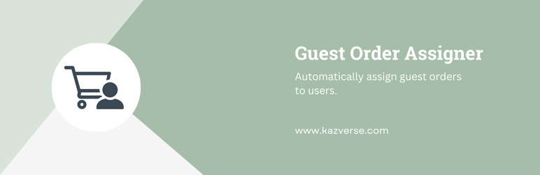
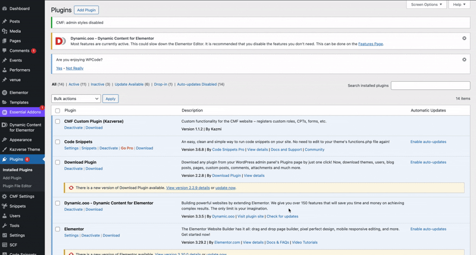
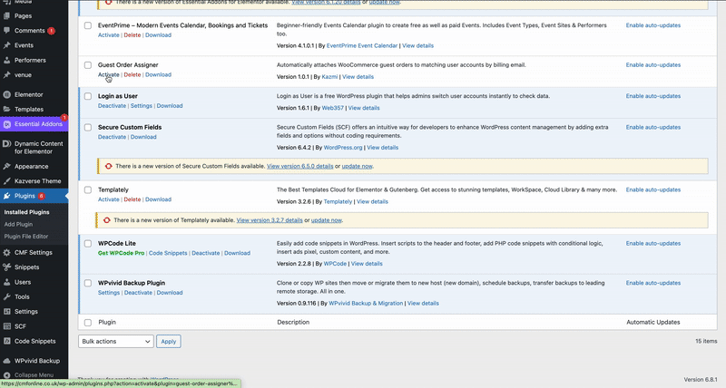
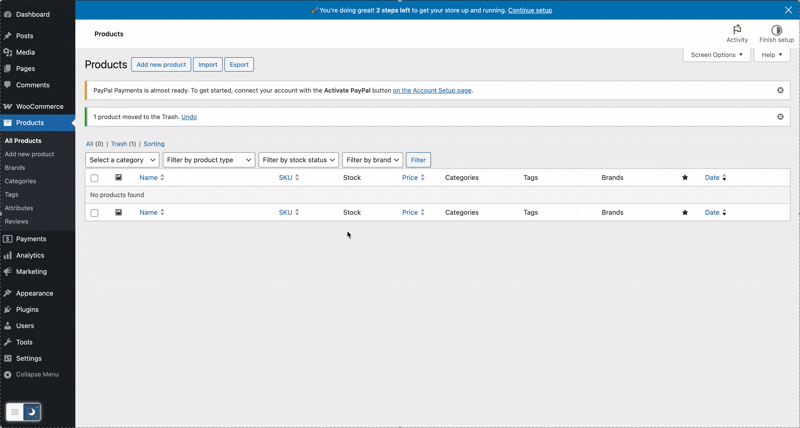
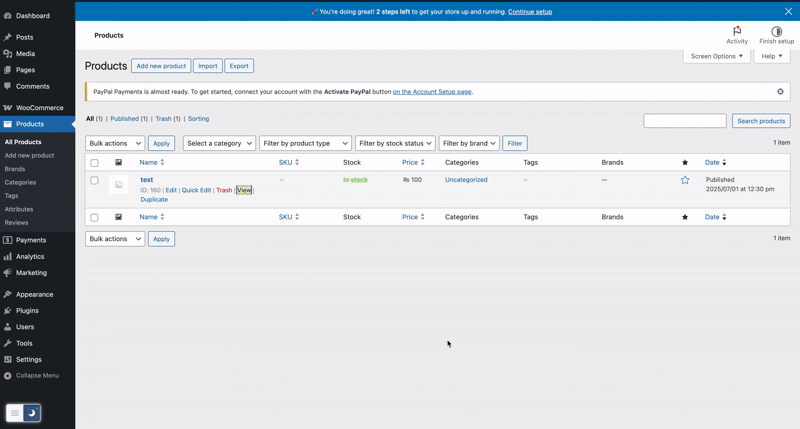
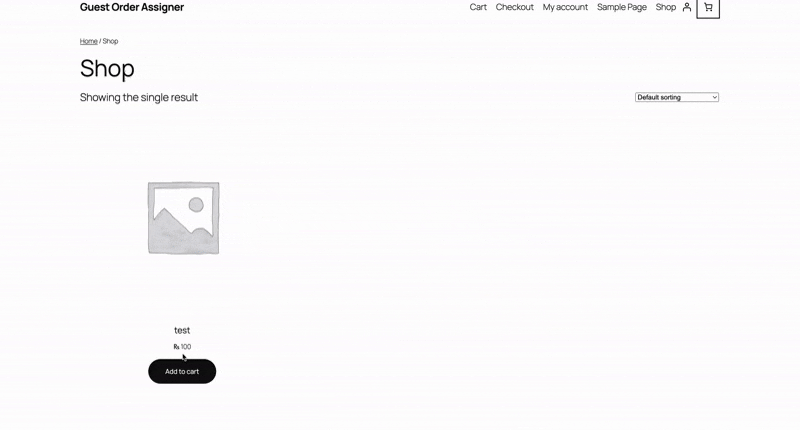
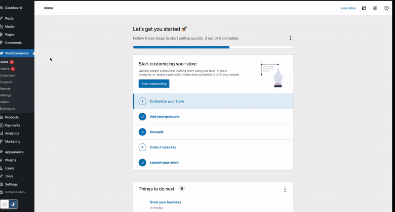

 

  

# Guest Order Assigner for WooCommerce

  

  <a href="https://github.com/SyedQalab/Guest-Order-Assigner/archive/refs/tags/v1.0.1.zip">Download latest release</a>

 

---

## Table of Contents

- [Features](#features)
- [Requirements](#requirements)
- [Installation](#installation)
- [Configuration & Customization](#configuration--customization)
- [How It Works](#how-it-works)

---

## Features

- 🔗 **Instant Assignment**  
  New guest orders with a billing email matching an existing account are immediately re-assigned.
- ⏪ **Historic Back-fill**  
  When a user registers or logs in, all previous guest orders with their email are attached.
- ⚡ **Zero Configuration**  
  Works out-of-the-box—no admin UI required.
- 🛠️ **Developer Hooks**  
  Extend via custom actions before/after assignment.

---

## Requirements

- **WordPress** 5.0 or higher
- **WooCommerce** 3.0 or higher
- **PHP** 7.2 or higher

---

## Installation

1. **Instal** `guest-order-assigner` from `wordpress` plugins.

   

2. Activate **Guest Order Assigner** in Plugins.

   

---

## How It Works

3. Create a **WooCommerce Product**.

   

4. Create a **Guest Order** and then check the order created.

   

5. Create a **Order** after logging in or create accout at checkout time.

   

6. Check a **WooCommerce Order Listing**.

   
